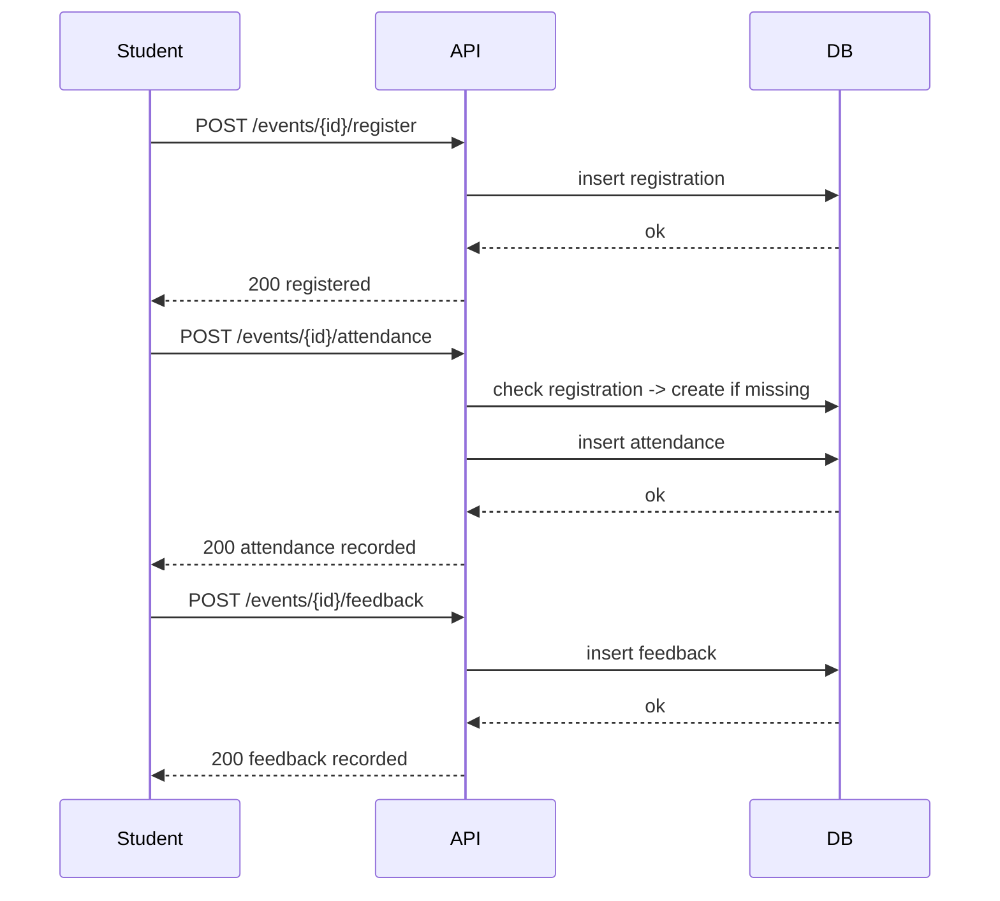

# Campus Event Reporting – Design Document

## 1. Overview
This is a small prototype for a campus event reporting system.  
It allows college staff to create events, students to register, mark attendance, and give feedback.  
Reports can be generated for:  
- Event popularity  
- Student participation  
- Top active students  

---

## 2. Database Design (ER / Schema)

### **Colleges**
| Column | Type | Notes |
|--------|------|------|
| id     | INT PK | Auto increment |
| name   | TEXT   | College name |
| code   | TEXT   | Short code (optional) |

### **Students**
| Column | Type | Notes |
|--------|------|------|
| id         | INT PK | Auto increment |
| name       | TEXT   | Student name |
| email      | TEXT   | Student email |
| roll_no    | TEXT   | Unique per college |
| college_id | INT FK | Links to Colleges table |

### **Events**
| Column     | Type | Notes |
|------------|------|------|
| id         | INT PK | Auto increment (unique globally) |
| title      | TEXT   | Event title |
| type       | TEXT   | Workshop/Fest/Seminar |
| college_id | INT FK | Links to Colleges table |
| start_time | DATETIME | Event start time |
| end_time   | DATETIME | Event end time |

### **Registrations**
| Column     | Type | Notes |
|------------|------|------|
| id         | INT PK | Auto increment |
| event_id   | INT FK | Links to Events table |
| student_id | INT FK | Links to Students table |

- Unique constraint: `(event_id, student_id)`

### **Attendance**
| Column     | Type | Notes |
|------------|------|------|
| id         | INT PK | Auto increment |
| event_id   | INT FK | Links to Events table |
| student_id | INT FK | Links to Students table |
| present    | BOOL   | True/False |

### **Feedback**
| Column     | Type | Notes |
|------------|------|------|
| id         | INT PK | Auto increment |
| event_id   | INT FK | Links to Events table |
| student_id | INT FK | Links to Students table |
| rating     | INT    | 1-5 |
| comments   | TEXT   | Optional |

> One feedback per `(event, student)`

---

## 3. API Endpoints

### College
**POST /colleges** → create new college  

```json
{
  "name": "ABC College",
  "code": "ABC"
}
```
### Student

**POST /students** → create student  

```json
{
  "name": "John",
  "email": "john@x.com",
  "roll_no": "CS101",
  "college_id": 1
}
```

### Event

**POST /events** → create event

```json
{
  "title": "Intro to AI",
  "type": "Workshop",
  "college_id": 1,
  "start_time": "2025-09-10T09:00:00",
  "end_time": "2025-09-10T12:00:00"
}
```

### Registration / Attendance / Feedback

***POST /events/{id}/register*** → register student
```json
{
  "student_id": 1
}
```

**POST /events/{id}/attendance*** → mark attendance
```json
{
  "student_id": 1,
  "present": true
}
```

***POST /events/{id}/feedback*** → submit feedback
```json
{
  "student_id": 1,
  "rating": 4,
  "comments": "Good"
}
```

### Reports

GET /reports/event_popularity?college_id=1&event_type=Workshop

GET /reports/event_stats/{event_id}

## 4. Workflow (Sequence Diagram)



## 5. Design Decisions & Assumptions

Single database for all colleges (easier for cross-college reporting)

Event IDs are unique globally

Registration is unique per student per event

Attendance table separate to track trends

Feedback limited to one per student per event

Marking attendance auto-registers student if missing (on-spot check-in)

## 6. Limitations / Future Improvements

No authentication or roles yet

SQLite used, so not optimized for large scale

Reports are basic text (no graphs/dashboards)

Future improvements: JWT auth, frontend/mobile client, PostgreSQL/MySQL, visual dashboards
